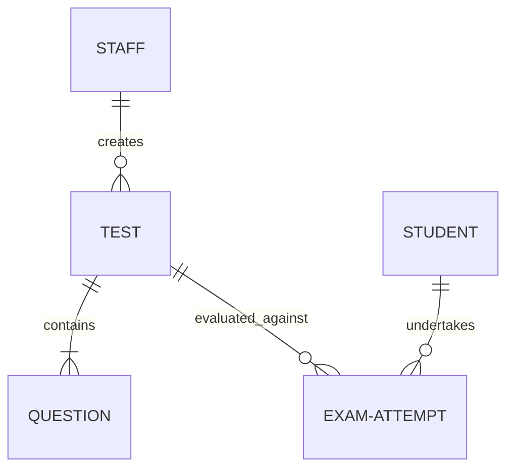

# CBT Mock Test Platform: Master Specification & Project Overview

This document serves as the master technical specification for the Geobucket Computer-Based Test (CBT) Mock Test Platform MVP. It outlines the monorepo file structure, technology dependencies, database collections, security protocols, question JSON structures, and administrative dashboard layouts.

---

## 1. Monorepo Project Structure

The project code is organized as a monolithic repository split into three top-level directories:

* **📁 [`server/`](file:///home/aqua/Documents/Geobucket-R2-cbt/server)**: Contains the Express Node.js API server, Mongoose models, authentication middleware, and exam grading logic.
* **📁 [`admin/`](file:///home/aqua/Documents/Geobucket-R2-cbt/admin)**: Contains the admin dashboard UI client (React + Vite) used by administrators, teachers, and counsellors.
* **📁 [`frontend/`](file:///home/aqua/Documents/Geobucket-R2-cbt/frontend)**: Contains the student examination portal client (React + Vite), including anti-cheating state-tracking mechanics and test interface components.

---

## 2. Technology Stack & Dependencies

The platform utilizes the following NPM packages to operate:

### A. Backend Dependencies (`server/package.json`)
* **`express`**: Minimalist web framework for routing requests and compiling middlewares.
* **`mongoose`**: MongoDB object modeling tool providing schema validation and translation.
* **`jsonwebtoken`**: Issues, signs, and decodes secure stateless JWT session tokens.
* **`bcryptjs`**: Cryptographic hashing function for one-way password encryption.
* **`cors`**: Middleware to configure cross-origin resources between the frontend clients and the backend port.
* **`dotenv`**: Loads configuration variables (Database URI, secret keys, port numbers) from local `.env` files.

### B. Frontend Clients Dependencies (`admin/package.json` & `frontend/package.json`)
* **`react`**: Declarative UI rendering library.
* **`react-dom`**: Interfaces and manages updates within browser DOM views.
* **`vite`**: High-performance compiler and bundler with fast Hot Module Replacement (HMR).

---

## 3. Database Architecture (MongoDB)

All data is stored in the `geobucket-cbt` database. Relational associations are maintained via references across five primary collections:



1. **`Staff`**: User metadata for admin dashboard accounts.
2. **`Student`**: Student metadata, identification indexes, and test permissions.
3. **`Test`**: Test configurations, rules, and marking formats.
4. **`Question`**: Detailed question bank. Linked to `Test` via `testId`. Stores correct options.
5. **`ExamAttempt`**: Logs of student examination sessions (answers, timestamps, and violation history).

---

## 4. Authentication, Encryption, and RBAC

The system enforces strict security layers to protect credentials and restrict route access:

### A. Staff Collection & Dashboard Access Roles
Staff roles restrict access to specific backend endpoints and admin panel views:
* **`admin`**: Full systems management, staff credentials generation, and deletion rights.
* **`teacher`**: Test CRUD configuration and question generation.
* **`counsellor`**: Read-only access to live proctor logs, attempt history, and cohort statistics (cannot make mutations).

```json
{
  "_id": "ObjectId",
  "name": "String",
  "email": "String", // Unique, format verified
  "passwordHash": "String",
  "role": "String" // Enum: "admin", "teacher", "counsellor"
}
```

### B. Student Collection & Exam Portal Entrance
Used strictly for candidates verifying entry on the frontend client. Access is checked using unique roll numbers.

```json
{
  "_id": "ObjectId",
  "rollNumber": "String", // Unique identifier, e.g., "GEO-2026-001"
  "name": "String",
  "email": "String",
  "passwordHash": "String",
  "eligibleTests": ["ObjectId"] // List of authorized Test ObjectIds
}
```

### C. Password Encryption Mechanism (`bcryptjs`)
Plaintext passwords are never saved in the database. During registration or password change events, inputs are salted and hashed:
1. **Work Factor Salting**: Generates a random cryptographic salt (salt factor of 10) for each password. Even identical passwords result in different hashes, stopping precompiled dictionary cracks.
2. **Comparison Verification**: Login matching performs secure timing-attack-resistant comparisons:
   ```javascript
   schema.methods.matchPassword = async function (enteredPassword) {
     return await bcrypt.compare(enteredPassword, this.passwordHash);
   };
   ```

### D. Session Management & Polymorphic Routing (JWT)
Upon successful verification, the backend generates a signed **JSON Web Token (JWT)** containing the user's database ID and account type scope (`staff` or `student`). Clients send this in the headers of all protected requests:
```http
Authorization: Bearer <token>
```

The backend server evaluates this token to handle polymorphic actions and prevent client-side URL tampering:
* **Polymorphic Content Delivery**: The server dynamically alters the returned payload depending on the `userType` stored in the token. For example, when fetching active tests and questions, student tokens return questions with the `correctAnswer` fields stripped to maintain exam integrity. Staff tokens from the Admin Panel return the complete schema objects including correct answer options.
* **Protection Against Client-Side URL Tampering**: Standard route protection middleware (`protect` and `requireRole`) verifies the cryptographic signature of the token and checks permission rights at the backend API level before querying MongoDB.
  * A student attempting to query staff endpoints (e.g., trying to access `/api/reports/tests/:id/summary` by guessing or modifying the URL on the client-side) will be immediately blocked by the backend middleware with a `403 Forbidden` response.
  * Forged or altered tokens (e.g. attempting to change `userType` to `'staff'`) fail token verification on the backend and return a `401 Unauthorized` response.

---

## 5. Question Type JSON Schemas

The platform supports three question types, each requiring distinct rendering inputs and correct-answer representations:

### A. MCQ (Multiple Choice / Single Correct)
* **Behavior**: Circular radio-button selectors. Only one option can be chosen.
* **Schema**:
```json
{
  "_id": "ObjectId",
  "testId": "ObjectId",
  "type": "MCQ",
  "content": "<p>Which hook is used to handle side effects in React?</p>",
  "options": [
    { "id": "opt_1", "text": "useState" },
    { "id": "opt_2", "text": "useEffect" }
  ],
  "correctAnswer": "opt_2" // Stored as a single string option ID
}
```

### B. MSQ (Multiple Select / Multiple Correct)
* **Behavior**: Checkbox selectors. Multiple options can be selected. All correct options must be checked to score points.
* **Schema**:
```json
{
  "_id": "ObjectId",
  "testId": "ObjectId",
  "type": "MSQ",
  "content": "<p>Select valid React hooks:</p>",
  "options": [
    { "id": "opt_1", "text": "useState" },
    { "id": "opt_2", "text": "useFetch" },
    { "id": "opt_3", "text": "useReducer" }
  ],
  "correctAnswer": ["opt_1", "opt_3"] // Stored as an array of string option IDs
}
```

### C. NAT (Numerical Answer Type)
* **Behavior**: Plain input text box or virtual keypad. No options are provided; the user types an exact number or decimal.
* **Schema**:
```json
{
  "_id": "ObjectId",
  "testId": "ObjectId",
  "type": "NAT",
  "content": "<p>Evaluate the expression: 3 * 4 + 5.</p>",
  "options": [], // Empty array for NAT
  "correctAnswer": 17 // Stored as a Number (supports float comparison on backend)
}
```

---

## 6. Exam Attempt & Submission History

Exam states are stored dynamically on the server inside the **`ExamAttempt`** collection to prevent timer reset or progress loss on page refresh.

```json
{
  "_id": "ObjectId",
  "studentId": "ObjectId",
  "testId": "ObjectId",
  "status": "String", // Enum: "active", "submitted", "locked"
  "startTime": "ISODate",
  "endTime": "ISODate", // Server-computed end time (startTime + test duration)
  "answers": [
    {
      "questionId": "ObjectId",
      "selectedAnswer": "Mixed", // MCQ option string, MSQ array, or NAT number
      "status": "String" // Enum: "not_visited", "answered", "marked_for_review", etc.
    }
  ],
  "securityViolations": [
    { "type": "fullscreen_exit", "timestamp": "ISODate", "details": "String" }
  ],
  "evaluation": {
    "finalScore": 36,
    "correctCount": 9,
    "incorrectCount": 1,
    "skippedCount": 0,
    "evaluatedAt": "ISODate"
  }
}
```

* **Live Persistence**: When students check an option or exit fullscreen, the client sends PATCH/POST requests. The server updates the attempt document in MongoDB.
* **Backend Evaluation (Submit)**: When the student clicks submit or the timer expires, the backend fetches the correct answers from the `Question` collection, evaluates the score against the marking scheme, updates the attempt status to `"submitted"`, and saves the results in the `evaluation` block.
* **Historical Queries**: 
  * Students fetch previous exam attempts by matching `studentId`.
  * Admin dashboards pull records matching `testId` to compute stats.

---

## 7. Administrative Dashboard Layout

The Admin Dashboard provides live monitoring tools and configuration controls divided into four core areas:

1. **Overview Dashboard**: General dashboard cards summarizing registrations, active tests, and active violation flags.
2. **Test & Question Builder**: Fullscreen overlays to create new tests and questions (select marking configurations and edit options).
3. **Live Proctor Panel**: Monitoring feed tracking student session status (`active`, `submitted`, `locked`) and violation counts.
4. **Reports & Analytics**: Tabular analytics detailing student-by-student scores, durations, and question difficulty indexes.

---

## 8. Test Credentials for Platform Verification

For local development, testing, and evaluation, the following pre-registered user accounts exist in the database:

### A. Staff Accounts (Admin Panel)
Staff log in via the Admin Login screen at `http://localhost:5173/` using their Email and Password:
* **Administrator User** (Full permissions):
  * **Email**: `admin@geobucket.com`
  * **Password**: `adminpassword`
* **Teacher User** (Test and question builder access):
  * **Email**: `teacher@geobucket.com`
  * **Password**: `teacherpassword`
* **Counsellor User** (Read-only proctor and reports access):
  * **Email**: `counsellor@geobucket.com`
  * **Password**: `counsellorpassword`

### B. Student Accounts (Candidate Portal)
Students verify their exam eligibility in the candidate portal using their Roll Number and Password:
* **Student 1**:
  * **Roll Number**: `GEO-2026-001`
  * **Password**: `studentpassword`
* **Student 2**:
  * **Roll Number**: `GEO-2026-002`
  * **Password**: `studentpassword`
